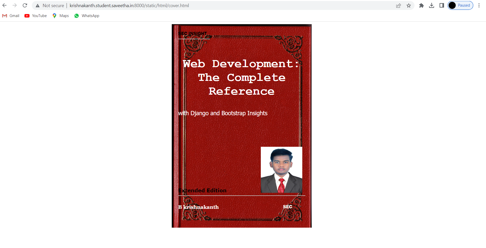
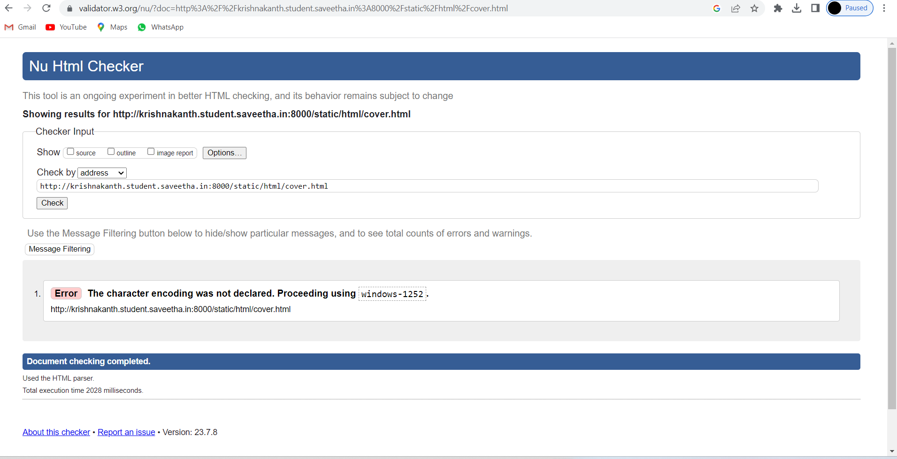

# cover-page-design
## AIM:
To develop a website to display the cover page design of a book

## Design Steps:

### Step 1:
Clone the Github repository and create a Django admin interface. 
### Step 2:
write HTML and CSS code for desigining book cover page and execute them.
## Code:
```
</div>
            <div class="hrstyle">
                <hr style="color: yellow;">
            </div>
            <div class="booktitle">
                <h1>Web Development: The Complete Reference</h1></div>
            <div class="subtitle">
                with Django and Bootstrap Insights
            </div>
            <div class="mypic">
                
            </div>
            <div class="id">
                <hr style="color: orange;">
            </div>
            <div class="author">
               <p><b>B krishnakanth</b></p>
            </div>
            <div class="pub">
                SEC
            </div>
            <div class="ed">
                <b>Extended Edition</b>
            </div>
        </div>
    </body>
</html>
```

## Output:




## Result:
The program for desining book cover page using HTML and CSS is excuted sucessfull.
